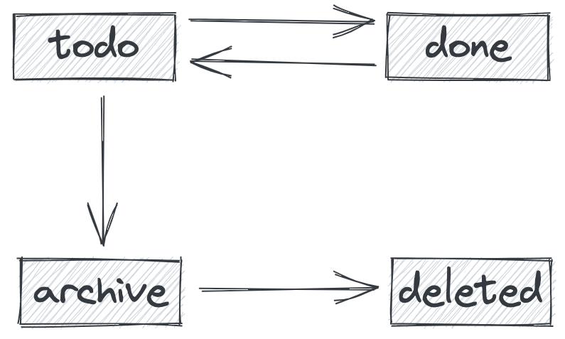

# Entity

```postgresql
CREATE TABLE todos
(
    namespace  VARCHAR(36) NOT NULL,
    id         SERIAL      NOT NULL,
    content    TEXT        NOT NULL,
    status     VARCHAR(32) NOT NULl,
    created_at TIMESTAMP   NOT NULL,
    updated_at TIMESTAMP   NOT NULL,
    PRIMARY KEY (namespace, id)
);
```

# API Endpoints

### Common Header

`t-ns` short for `todo namespace`

```text
t-ns: {NS}
```

### GET /todos

get a list of todos

query

```
?status=todo
```

body

```json
[
  {
    "id": 1,
    "namespace": "default",
    "content": "first thing",
    "status": "todo",
    "create_at": 1647151812778
  }
]
```

### POST /todos

create a todo

body

```json
{
  "content": "second thing"
}
```

### PATCH /todos/{id}

update todo, available status:

* todo
* done
* archive

```json
{
  "content": "updated thing",
  "status": "done"
}
```

### DELETE /todos/{id}

delete a **archived** todo

# Status Transform




# Project Structure

## Common

shared by backend and frontend

```text
- client.rs
- model.rs
```

## Backend

```text
- handlers/
    - todo_handler.rs
- domains/
    - todo_domain.rs
    - todo_repository.rs
- infra/
    - utils.rs
    - config.rs
    - db.rs
```

## Frontend

```text
- components/
- hooks.rs
- icons.rs
- states.rs
```
