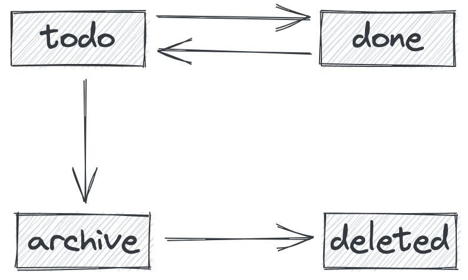

# Get Started

Learn Rust by doing.

- to do application
- TDD
- fullstack (all in rust)

# Stack

web

- actix-web
- diesel

web-assembly

- yum

deployment

- postgres
- supabase
- heroku

# Design

## Entity

```postgresql
CREATE TABLE todos
(
    id         SERIAL PRIMARY KEY,
    content    TEXT      NOT NULL,
    status     SMALLINT  NOT NULl,
    created_at TIMESTAMP NOT NULL,
    updated_at TIMESTAMP NOT NULL
);
```

## API Endpoints

### GET /todos

get a list of todos

query

```
?status=todo
```

body

```json
[
  {
    "id": 1,
    "content": "first thing",
    "status": "todo",
    "create_at": 1647151812778
  }
]
```

### POST /todos

create a todo

```json
{
  "content": "second thing"
}
```

### PATCH /todos/{id}

update content of a todo

```json
{
  "content": "updated thing"
}
```

### PATCH /todos/{id}/{status}

available status:

- todo
- done
- archive

update status of a todo

[no body]

### DELETE /todos/{id}

delete a **archive** todo

## Status Transform



# Backend

## Mods

```text
src/
- main.rs
- lib.rs
- apis/
    - todo_handler.rs
- applications/
    - todo_application_service.rs
- domains/
    - todo_domain.rs
- infra/
    - utils.rs
tests/
```

unit test
e2e test
integration test
